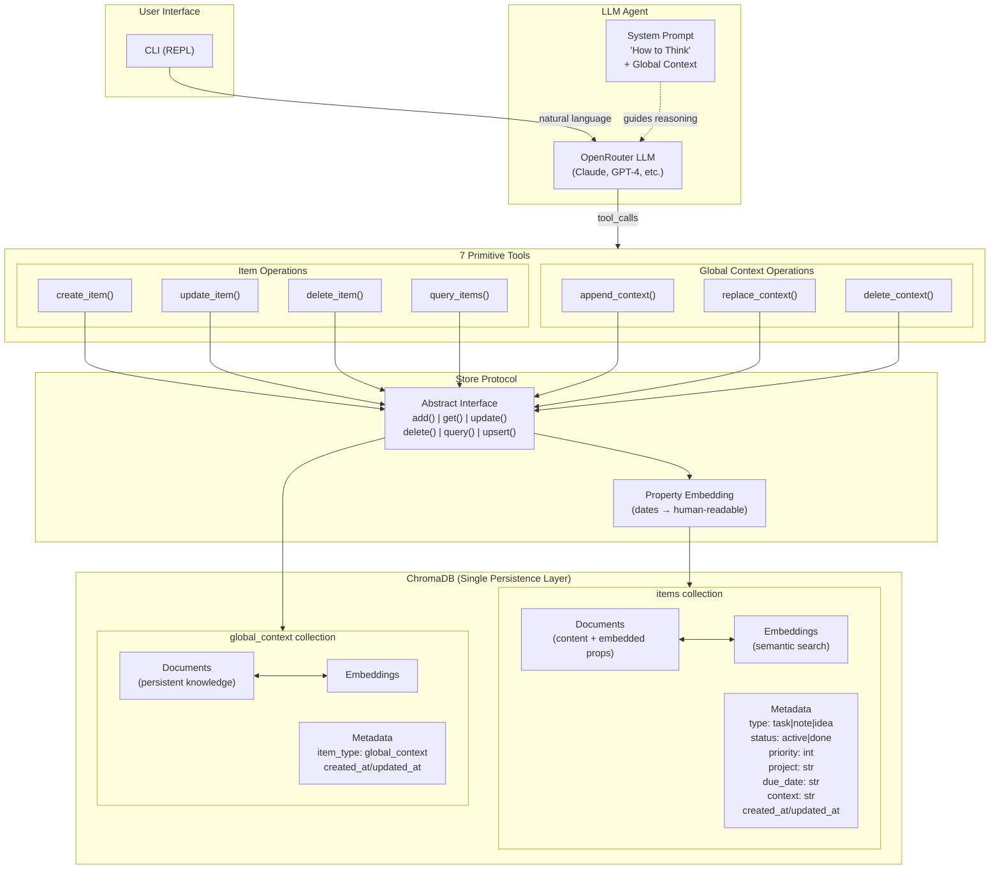

# Architecture Diagrams

## ChromaDB Utilization & Agent Tool Flow

This diagram shows how the LLM agent leverages ChromaDB through the 7 primitive tools.



### Key Design Decisions

| Aspect | How It Works |
|--------|--------------|
| **Semantic Search** | Every item gets embedded — "find similar tasks" works automatically |
| **Property Embedding** | Properties are embedded in document content with human-readable dates for semantic search |
| **Flat Metadata** | No nested objects (ChromaDB limitation) — properties are flattened |
| **Emergent Structure** | `type`, `status`, `project` aren't schema-enforced — LLM decides when to use them |
| **Global Context** | Always-present knowledge injected into system prompt — shapes all reasoning |
| **The Hedge** | `Store` protocol abstracts ChromaDB — can swap to SQLite without touching tools |

### Data Flow Examples

**Creating a task:**
```
User: "Add a task to review the quarterly report by Tuesday"
  → LLM reasons about intent
  → Calls create_item(content="review the quarterly report",
                      properties={type: "task", status: "active", due_date: "2026-01-13"})
  → Store.add() embeds properties into content:
      "review the quarterly report\n---ANA_PROPS---\ntype: task\nstatus: active\ndue date: Tuesday January 13 2026"
  → Writes to ChromaDB items collection
  → Returns clean content to agent (properties stripped)
```

**Finding tasks by date (semantic search):**
```
User: "What's due on Tuesday?"
  → LLM calls query_items(text="due Tuesday")
  → Semantic search matches embedded "due date: Tuesday January 13 2026"
  → Returns items with clean content (properties stripped)
  → LLM presents results
```

**Using Global Context:**
```
User: "I prefer to do deep work in the mornings"
  → LLM calls append_context("Prefers deep work in mornings")
  → Stored in global_context collection
  → Injected into system prompt for ALL future conversations
  → Shapes recommendations without explicit recall
```
