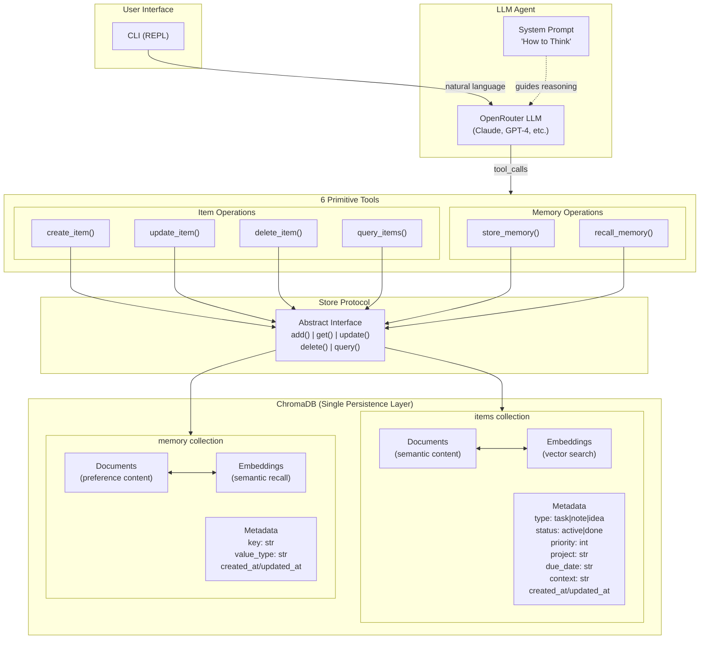

# Architecture Diagrams

## ChromaDB Utilization & Agent Tool Flow

This diagram shows how the LLM agent leverages ChromaDB through the 7 primitive tools.



### Key Design Decisions

| Aspect | How It Works |
|--------|--------------|
| **Semantic Search** | Every item gets embedded — "find similar tasks" works automatically |
| **Flat Metadata** | No nested objects (ChromaDB limitation) — properties are flattened |
| **Emergent Structure** | `type`, `status`, `project` aren't schema-enforced — LLM decides when to use them |
| **Memory Recall** | `recall_memory("deep work")` — semantic similarity finds relevant preferences |
| **The Hedge** | `Store` protocol abstracts ChromaDB — can swap to SQLite without touching tools |

### Data Flow Examples

**Creating a task:**
```
User: "Add a task to review the quarterly report"
  → LLM reasons about intent
  → Calls create_item(content="review the quarterly report", properties={type: "task", status: "active"})
  → Store.add() writes to ChromaDB items collection
  → Content embedded for future semantic search
```

**Recalling preferences:**
```
User: "What should I focus on today?"
  → LLM calls recall_memory("work preferences focus")
  → Semantic search finds "prefers deep work in the morning"
  → LLM incorporates into recommendation
```
